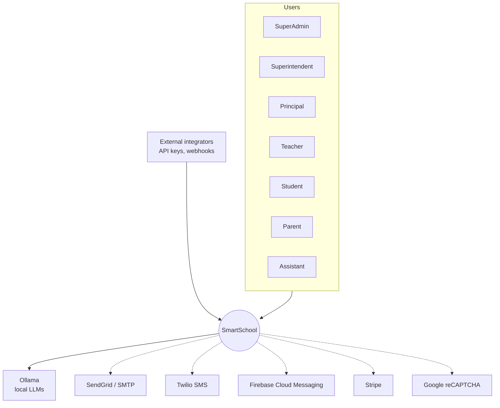
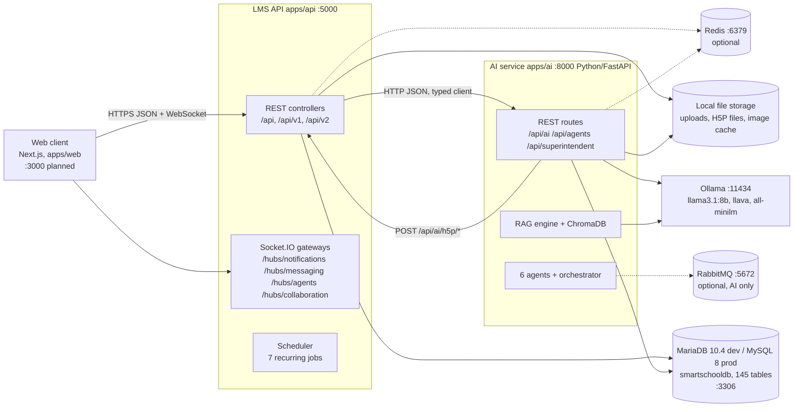
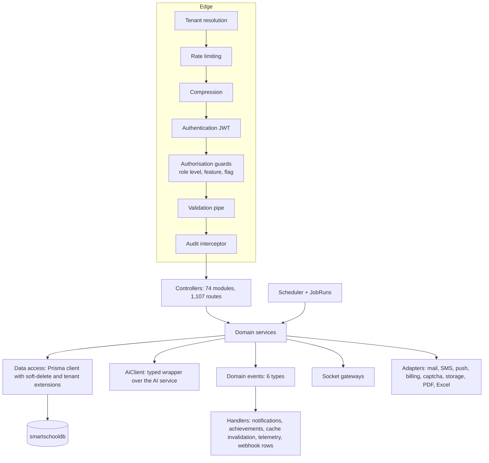
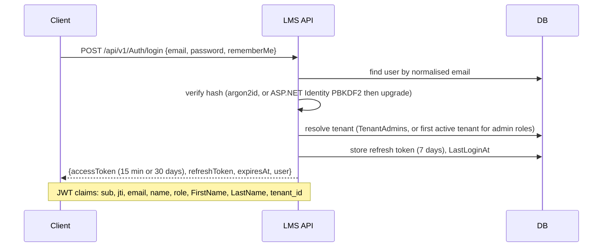
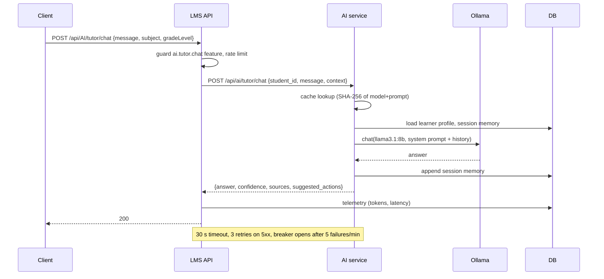
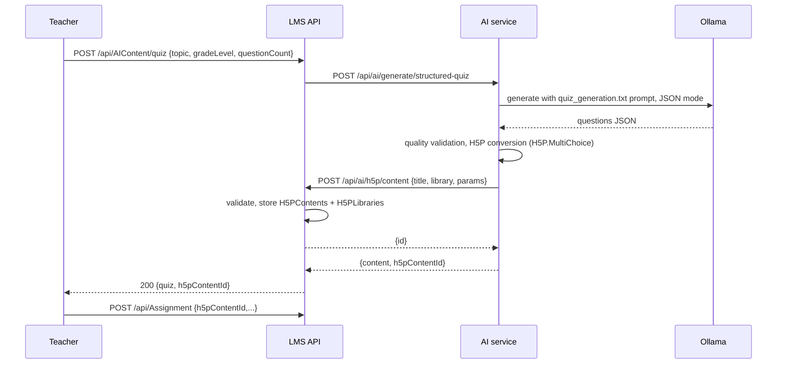
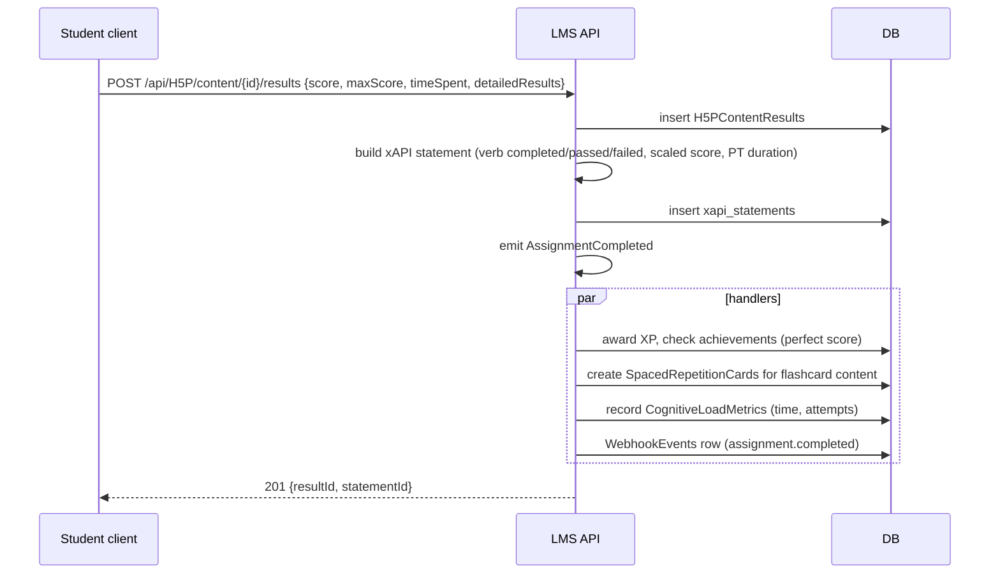
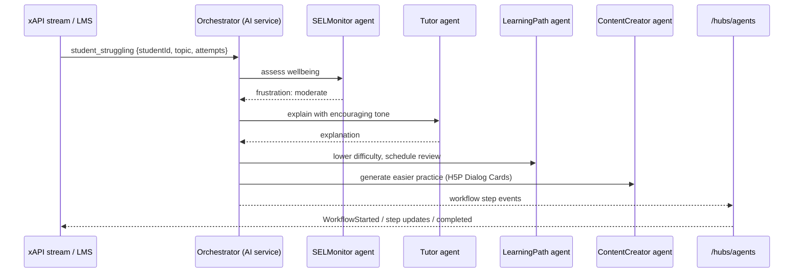
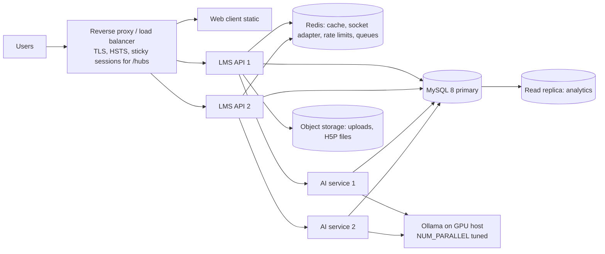

# SmartSchool System Architecture

**Version:** 1.1, 30 September 2026
**Audience:** engineers building, reviewing or operating SmartSchool.
**Scope:** the whole system as it is being built: a Node.js LMS API on XAMPP MySQL (`apps/api`), the retained Python AI service (`apps/ai`), local LLM inference, and the planned web client (`apps/web`).

---

## 1. Architectural summary

SmartSchool is two services over one database, with all AI inference local.

- The **LMS API** owns identity, tenancy, the academic domain, communication, gamification, content storage, the xAPI learning record store, analytics and the SaaS administration surface. It is the only service the web client talks to. Target: NestJS 11 on Node 22+. Same routes, same database, same behaviour as the previous C# implementation minus the stubs.
- The **AI service** (Python, FastAPI) owns everything that needs a model: tutoring, content generation, grading, plagiarism, code evaluation, learning analytics, RAG over curriculum standards, multimodal processing, image generation, emotion detection, the six autonomous agents and their workflows. It calls Ollama and its own ChromaDB index, reads and writes twelve shared tables, and calls back into the LMS for H5P storage.
- **MariaDB/MySQL** is the single system of record (145 tables). **Ollama** serves `llama3.1:8b` (text), `llava` (vision) and, after Phase 0, `all-minilm` (embeddings). Redis and RabbitMQ are optional accelerators; both services run without them.

Design principles:

1. **Local first.** No student data leaves the deployment. Cloud providers (SendGrid, Twilio, Firebase, Stripe) are optional adapters for notifications and billing only.
2. **One database, clear ownership.** Both services share `smartschooldb`; each table has exactly one writing owner (see the Data Model).
3. **AI is a dependency, not a decoration.** Every AI-backed endpoint either calls the model or reports that it cannot. No canned answers (ADR-008).
4. **Preserve contracts across the rewrite.** Routes, JSON shapes, socket events, job schedules and table names are kept so the client and the AI service do not change when the LMS implementation does (ADR-010).
5. **Optional infrastructure degrades gracefully.** Redis, RabbitMQ, external providers and the code sandbox all have in-process or disabled fallbacks (ADR-014).

---

## 2. System context

**Actors.** Roles form a hierarchy used for coarse authorisation (SuperAdmin 6, Superintendent 5, Principal 4, Teacher 3, Student 2, Parent 1, Assistant 1) and a 200-code feature catalogue used for fine-grained permissions. Superintendents see districts and budgets; principals see a school; teachers run classes and use AI tools; students learn and are tutored; parents observe and message; SuperAdmin administers tenants and features. External integrators use tenant API keys and receive webhooks.

**External systems.** Ollama is required and local. The five cloud providers are disabled until credentials exist; each adapter has an enabled switch.

---

## 3. Container view

| Container | Technology | Responsibilities | Scales by |
|---|---|---|---|
| Web client | Next.js 14 (planned) | All UI, H5P player (`h5p-standalone`), socket client | CDN / static |
| LMS API | NestJS 11 on Node 22+ | Identity, tenancy, academic domain, communication, gamification, content store, xAPI LRS, analytics, SaaS admin, jobs, real-time | Horizontal, stateless; sticky sessions or Redis adapter for sockets |
| AI service | Python 3.11+ FastAPI (retained) | Everything model-backed; agents; RAG; multimodal; images; emotion | Horizontal by CPU/GPU; Ollama is the bottleneck |
| Database | MariaDB 10.4 (XAMPP, dev) / MySQL 8 or MariaDB 10.11 (prod) | System of record; 145 tables | Vertical, read replica |
| Ollama | Go binary, local | LLM, vision, embeddings | GPU, `OLLAMA_NUM_PARALLEL` |
| Redis | optional | Cache, rate-limit counters, socket adapter, agent state, job queue | Managed or container |
| RabbitMQ | optional, AI only | Durable inter-agent bus | Container |
| File storage | local disk, S3-compatible optional | Uploads, H5P libraries and content files, generated images | Object store |

---

## 4. LMS API components

### 4.1 Layering

Rules:

- Controllers only bind, validate, authorise and call one service method. No business logic, no direct data access.
- Services hold the rules. Ownership checks (a teacher grades only their classes, a parent sees only linked students) live here, not in guards.
- Data access goes through the Prisma client, whose extensions add `DeletedAt IS NULL` to reads of soft-deleted entities and inject `TenantId` for tenant-scoped entities. Raw SQL is allowed only in analytics services and must be tenant-filtered explicitly.
- Anything that leaves the process (AI service, mail, SMS, push, Stripe, webhooks) goes through an adapter with a timeout, retry policy and circuit breaker, and can be disabled by configuration.

### 4.2 Bounded contexts and modules

| Context | Modules (route base) | Notes |
|---|---|---|
| Identity and access | `auth` (`/api/v1/Auth`, `/api/v2/Auth`), `security` (`/api/v1/Security`), `ip-whitelist` (`/api/v1/IPWhitelist`), `features` (`/api/admin/features`, `/api/admin/roles`, `/api/admin/users`, `/api/features`) | JWT, refresh, 2FA, audit, feature permissions |
| Organisation and district | `organizations` (`/api/v1/Organization`), `district` (`/api/v1/district/schools`, `/staff`, `/budget`) | Organisation is the school-level container; tenant is the SaaS-level one |
| Academic core | `students`, `courses`, `classes`, `assignments`, `grades`, `attendance`, `announcements`, `calendar` | The heart of the LMS |
| Files and library | `files` (`/api/File`), `digital-library` (`/api/v1/library`) | Local disk storage with metadata rows |
| Communication | `notifications`, `push`, `messaging` + `/hubs/messaging` and `/hubs/notifications` | Real-time |
| Engagement | `gamification`, `parent-portal` (two route families) | XP, badges, titles, parent insights |
| AI bridge | `ai`, `ai-content`, `teacher-ai`, `superintendent-ai`, `agents` + `/hubs/agents`, `ai-h5p` (callbacks), `content-recommendations`, `student-ai-data` | Thin: validates, authorises, calls the AI service, persists results |
| Interactive content | `h5p`, `h5p-content-types`, `xapi`, `h5p-xapi` | H5P store and xAPI LRS |
| Learning science | `srs`, `mastery`, `cognitive-load`, `learning-curve`, `sel`, `accessibility`, `career`, `integrated-learning` | Algorithms (SM-2, forgetting curve) plus AI calls |
| Analytics and reports | `analytics` (four controllers), `reports` (PDF), `mobile` | Read-mostly, cached |
| Content ecosystem | `content-library`, `content-collections`, `content-analytics`, `community` (includes forums) | Teacher-created and AI-generated content sharing |
| SaaS platform | `tenant`, `tenant-admin`, `tenant-analytics`, `tenant-billing`, `tenant-security`, `tenant-compliance`, `tenant-webhooks`, `tenant-reports`, `api-gateway`, `webhooks` | White-label, plans, billing, compliance, API keys |
| Portfolio and careers | `portfolio`, `public-portfolio`, `stakes`, `resume`, `code`, `recruiting` | Student showcase and recruiting |
| Platform | `health` (`/health`, `/api/Health`) | Health, readiness, dependency checks |

### 4.3 Real-time gateways

Four namespaces, JWT on the handshake (`access_token` query parameter or `auth.token`), rooms per user, conversation, class, organisation, agent and workflow. Event names are the contract and are listed in the Integration Contracts document. Presence is per process; multi-instance deployments add the Redis adapter.

### 4.4 Background processing

| Job | Cron | Purpose |
|---|---|---|
| delete-expired-notifications | `0 2 * * *` | Remove read notifications older than 30 days |
| daily-attendance-report | `0 6 * * *` | Per-class attendance summary for the previous day |
| cleanup-soft-deleted-files | `0 3 * * 0` | Purge files soft-deleted beyond retention |
| warm-analytics-cache | `0 7 * * 1-5` | Pre-compute dashboard aggregates |
| webhook-delivery-processor | `*/2 * * * *` | Deliver pending webhook events with backoff |
| scheduled-reports-processor | `*/15 * * * *` | Generate and email due report schedules |
| push-notification-cleanup | weekly Sun 02:00 | Deactivate devices unused for 90 days |
| cache-warmup, analytics-aggregation, ai-recommendations-refresh, data-cleanup | scheduler-defined | Snapshots into `ClassAnalytics`, nightly recommendation refresh capped at 20 students, purge of old logs and tokens |

A `JobRuns` table records lock, last run and last status so only one instance runs a job and operators can see history at `/api/admin/jobs`.

---

## 5. AI service components

The AI service is retained in language and structure. Its module map:

| Layer | Modules | Role |
|---|---|---|
| Edge | `main.py` (155 routes, 109 request models), `config.py` | HTTP surface, settings, CORS, optional API key |
| Gateway | `ai_gateway.py`, `resilience.py`, `response_cache.py`, `content_cache.py`, `observability.py` | Model roles (primary, fast, vision), 60/min limiter, SHA-256 response cache, retry and circuit breaker, structured logs and Prometheus metrics |
| Prompts | `prompt_loader.py`, `prompts/` (57 templates by category: tutoring, assessment, content types, personalization, accessibility, advanced subject prompts) | The pedagogical content of the system; versioned text |
| Knowledge | `rag_service.py`, `curriculum_indexer.py`, `curriculum_data/` (Common Core ELA and Math, NGSS), ChromaDB, `sentence-transformers` | Curriculum-aligned retrieval; hybrid search |
| Tutoring | `ai_tutor.py`, `ai_tutor_enhanced.py`, `session_memory.py`, `learner_memory.py`, `query_classifier.py` | Socratic dialogue, homework help, explanations, gap analysis, learning paths |
| Generation | `content_generators.py`, `batch_generator.py`, `quality_validator.py`, `content_quality.py`, `evaluator_agent.py`, `h5p_*.py` | Structured quizzes, flashcards, video scripts and 14 more types; validation; conversion to 21 H5P library formats; storage through the LMS callback |
| Assessment | `essay_grader.py`, `assessment_intelligence.py`, `code_evaluator.py`, `plagiarism_detector.py` | Rubric grading, formative checks, rubric generation, peer review, code tests, plagiarism |
| Analytics | `learning_analytics.py`, `learning_profile.py`, `predictive.py`, `adaptive_path.py`, `content_recommender.py`, `analytics.py` | Style detection, performance and risk prediction, interventions, recommendations |
| Agents | `base_agent.py`, `agent_registry.py`, `agent_state_service.py`, `message_bus_service.py`, `agent_orchestrator.py`, `agent_workflows.py`, `content_creator_agent.py`, `learning_path_agent.py`, `tutor_agent.py`, `specialized_agents.py` (Assessment, SELMonitor, Gamification), `image_creator_agent.py` | Autonomous agents, six predefined workflows, Redis state and RabbitMQ bus with in-memory fallbacks |
| Perception | `multimodal_service.py`, `emotion_detection.py`, `image_generation_service.py` | OCR, worksheet and math analysis, transcription (placeholder), charts and diagrams, facial emotion (DeepFace), image generation (diffusers) and editing |
| Leadership | `superintendent_ai.py` | District-level chat, reports, insights, charts |
| Data | `database.py`, `crud.py` | SQLAlchemy models and CRUD for the 12 shared tables |

Improvements the AI service needs regardless of the LMS rewrite: unify the database URL with the LMS, keep `llama3.1:8b` as the default model, install the optional perception dependencies where the feature is wanted, implement or disable audio and video transcription, and run code evaluation in a sandbox instead of a host `subprocess` (ADR-013).

---

## 6. Key runtime flows

### 6.1 Login and tenant claim

### 6.2 Request pipeline

Every request passes, in order: tenant resolution (header, subdomain, custom domain, JWT claim, query; cached five minutes; suspended tenants get 403), rate limiting (per API key, user or IP; `X-RateLimit-*` headers; fail-open), response compression, JWT authentication, authorisation guards (role level, feature code, feature flag), DTO validation, then the controller. On a 2xx response the audit interceptor writes an `AuditLogs` row for actions marked auditable.

### 6.3 AI tutor chat

### 6.4 AI-generated H5P content

### 6.5 H5P completion to learning record and rewards

### 6.6 Real-time messaging

Client joins `/hubs/messaging` with its JWT; the gateway joins it to `user_{id}` and every `conversation_{id}` it participates in and broadcasts `UserOnline`. `SendMessage(conversationId, content)` persists through the messaging service and emits `ReceiveMessage` to the conversation room; typing, read receipts, edits, deletes and participant changes follow the same pattern. REST endpoints under `/api/Messaging` manage conversations; the socket carries messages.

### 6.7 Webhook delivery

Domain events write `WebhookEvents` rows. Every two minutes the delivery job selects pending `WebhookDeliveries`, signs the payload with the subscription secret (HMAC-SHA256 in `X-Webhook-Signature`), posts it, and records status; failures back off exponentially up to the subscription's retry limit. Tenant-level webhooks (`TenantWebhooks`) follow the same design with tenant event subscriptions.

### 6.8 Multi-agent intervention workflow

Workflows are dependency-aware step graphs (`agent_workflows.py`): content generation, personalised learning, student intervention, assessment and feedback, daily engagement, batch content generation.

---

## 7. Data architecture

One database, 145 tables, PascalCase names, `char(36)` UUID keys, UTC `datetime(6)` timestamps, enums stored as integers. The LMS API writes 133 tables; the AI service writes 12 (learner profiles, performance records, learning paths, recommendations, assessment results, interventions, and the four emotion tables). Twenty-five entities are soft-deleted; tenant-scoped entities carry `TenantId`. Vectors live in ChromaDB inside the AI service, never in MariaDB. Files live on disk with metadata in `FileUploads`, `H5PFiles` and the AI image cache. Caches (LLM responses, tenant lookups, feature sets, rate-limit counters) are in-memory with Redis as an optional shared store. Full detail: [03-DATA-MODEL.md](03-DATA-MODEL.md).

---

## 8. Cross-cutting concerns

| Concern | Design |
|---|---|
| Identity | ASP.NET Identity table shape kept. Argon2id for new passwords; PBKDF2 (Identity v3) verified and upgraded on login. Refresh tokens are opaque, stored on the user, rotated on use, revocable. TOTP 2FA with hashed backup codes. Password policy: 12+ chars with upper, lower, digit, symbol. |
| Authorisation | Three layers: role hierarchy for coarse gates; feature codes (`students.create`, `ai.tutor.chat`, 200 seeded) resolved from role assignments plus per-user overrides with expiry, cached five minutes; ownership checks in services. |
| Multi-tenancy | Shared database, `TenantId` column, request-scoped tenant context. Tenant status (Pending, Active, Suspended, Cancelled, Expired, Inactive) enforced at the edge. Branding and feature configuration loaded with the tenant. Organisations nest inside tenants. |
| API conventions | Base `/api`; URI versioning with v1 default and explicit v2 controllers; camelCase JSON; ISO-8601 UTC; GUID strings; `PagedResponse` (`data, pageNumber, pageSize, totalRecords, totalPages, hasPrevious, hasNext`); v2 error envelope (`success, message, errorCode, errors, timestamp`); OpenAPI at `/swagger` per version. |
| Validation | DTO validation at the edge (class-validator); LLM output validated against schemas before persistence. |
| Errors | Domain exceptions map to 400/403/404/409; unexpected errors return 500 with a reference id and are logged with stack traces; 501 is reserved for features deliberately not implemented. |
| Resilience | Every outbound call has a timeout (AI 30 s default, 120 s generation), retry with backoff on transient failures, and a circuit breaker (5 failures per minute opens for 30 s). Rate limiting and tenant resolution fail open. |
| Caching | In-memory first (tenant, features, analytics, LLM responses), Redis when configured. Cache invalidation on content update events. |
| Observability | Structured JSON logs with request id, user id and tenant id; Prometheus metrics from both services (`/metrics`); health endpoints that report database, AI service, Ollama, Redis and circuit-breaker state. |
| Files | Upload limit 10 MB, extension allowlist, random storage names, MIME sniffing, soft delete with scheduled purge. |
| Configuration | Environment variables validated at boot; placeholders refused outside development; secrets never in the repository (ADR-012). |

---

## 9. Security architecture

**Assets:** student PII and academic records (FERPA), minors' data (COPPA), EU users (GDPR), tenant credentials and API keys, LLM prompts and outputs.

**Controls:** HTTPS at the reverse proxy; HSTS; `helmet` headers; strict CORS allowlist; JWT with short expiry and rotation; password hashing and policy; 2FA; login throttling (5 per minute per IP); per-tenant and per-key rate limits; optional IP whitelist middleware; audit log of state-changing actions with IP and user agent; tenant isolation enforced in data access and verified by an automated two-tenant test; upload validation; input validation on every DTO; parameterised queries only; secrets from environment; dependency audit in CI; webhook payload signing; consent management and data-subject requests for emotion data and tenant compliance; retention jobs.

**Known risks and their treatment:** old credentials in the previous repository's history (rotate, never reuse); code evaluation on the host (sandbox container or disable); LLM prompt injection (system prompts separated from user content, output schemas, guardrails engine, no tool execution from model output without allowlists); model hallucination in grading (suggestions require teacher review before a grade is posted; the UI must label AI output).

---

## 10. Deployment architecture

### 10.1 Development (this machine)

Windows 11, XAMPP MariaDB 10.4 on 3306 (after stopping the `MySQL800` service), LMS API on 5000, AI service on 8000 in a Python venv, Ollama on 11434, no Redis. Two terminals plus the XAMPP control panel. See the build plan for the exact checklist.

### 10.2 Production-like (Docker Compose)

Services: `mysql` (or `mariadb:10.11`), `ollama`, `ai`, `api`, optional `redis` and `rabbitmq`, all on one network with health checks and dependency ordering. Persistent volumes for the database, Ollama models, ChromaDB, uploads and image cache.

### 10.3 Production topology

Operational rules: migrations run once by a job before new API instances start; sockets need sticky sessions or the Redis adapter; Ollama is sized by concurrent generation requests (each 8B request holds roughly 5 GB of VRAM or RAM); nightly logical backups plus binary log retention; secrets from the platform's secret store.

---

## 11. Scalability and performance

| Target | Value | How |
|---|---|---|
| List endpoints p95 | under 200 ms with seeded data | Indexes carried from the previous schema, tenant composite indexes, pagination everywhere, read replica for analytics |
| Tutor chat p95 | under 15 s | Response cache, `llama3.1:8b`, no LLM call inside list endpoints, streaming considered for the client |
| Content generation | under 60 s, asynchronous for batches | Batch job queue in the AI service; LMS polls or receives a webhook |
| Concurrent users | 1,000 per API instance pair | Stateless API, connection pool sized to `max_connections`, socket adapter |
| LLM concurrency | `OLLAMA_NUM_PARALLEL` × instances | Queue in the AI gateway; 429 with `Retry-After` when saturated |

---

## 12. Non-functional requirements

| Attribute | Requirement |
|---|---|
| Availability | 99.5 percent for the LMS API; AI features degrade to 503 with a clear message when Ollama is down, the LMS keeps working |
| Data privacy | No student data to third parties except configured notification and billing providers; all inference local |
| Compliance | FERPA access controls and audit; COPPA parental consent for emotion features; GDPR consent, export and deletion |
| Accessibility | API exposes accommodations, UDL profiles and simplified-content endpoints; the web client targets WCAG 2.1 AA |
| Maintainability | One language per service, module-per-domain layout, generated endpoint inventory, contract tests |
| Portability | Runs on Windows with XAMPP for development and on Linux containers for production; database engine differences covered by CI |

---

## 13. Known gaps carried from the previous implementation

Confirmed in the previous code on 30 September 2026 and to be closed (or returned as 501) during the rebuild:

- The previous `RAGServiceClient` called `/api/rag/query`, `/api/rag/index` and `/api/rag/index/batch`, which the AI service does not expose (it has `/api/ai/rag/curriculum/search`, `/api/ai/rag/curriculum/index`, `/api/ai/rag/generate`). The new client uses the real routes ([04-INTEGRATION-CONTRACTS.md](04-INTEGRATION-CONTRACTS.md)).
- Stubbed behaviour: accessibility audit simulation, career matching placeholder, integrated-learning constant metric, stake score constant, billing usage zeros, calendar meeting links, H5P parameter optimisation no-ops. Each is listed in the feature catalog with its target behaviour.
- AI service placeholders: video and audio transcription, voice emotion, H5P feedback persistence, content-to-image agent link.
- Phase 8 Sprint 4 hooks (H5P completion to XP, spaced repetition and cognitive load) were never wired.
- External integrations were implemented but disabled; RabbitMQ and Redis are absent from the development machine.
- No web client existed.

---

## 14. Decision log

See [05-ADR.md](05-ADR.md). The decisions that most constrain this architecture: keep the Python AI service (ADR-001), rebuild the LMS API in Node.js (ADR-002), preserve the database schema and routes (ADR-003, ADR-010), shared-database multi-tenancy (ADR-005), no fake AI (ADR-008), the AI service owns the agent runtime (ADR-009), and workspace naming (ADR-016).
