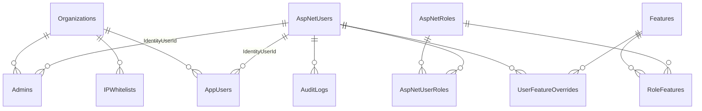
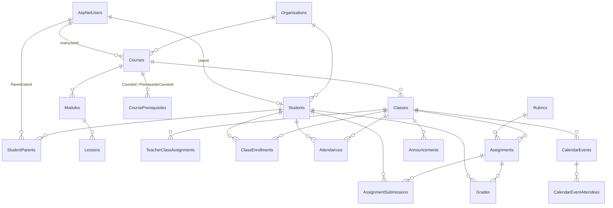
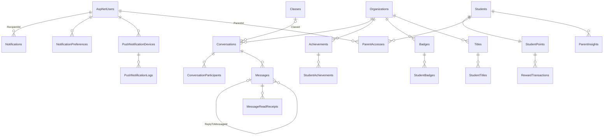
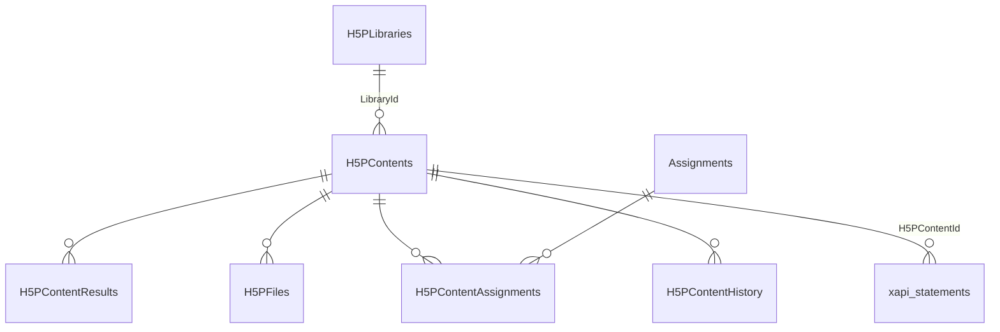

# SmartSchool Data Model

**Version:** 1.1, 30 September 2026
**Source of truth:** `apps/api/prisma/schema.prisma`. The full schema is generated from the previous EF Core snapshot (459 entity builders, 213 mapped tables including EF join and owned types, 376 foreign keys, 529 indexes) and the previous `database.py` (12 tables), then hand-checked. Phase 0 ships the identity, organisation, feature, audit and `JobRuns` subset.

---

## 1. Conventions

| Convention | Rule |
|---|---|
| Naming | PascalCase table and column names exactly as the previous schema created them (`Students.FirstName`). One exception: `xapi_statements`. |
| Keys | `Id char(36)` UUID generated by the application. ASP.NET Identity tables use `varchar(255)` string ids. |
| Timestamps | `CreatedAt datetime(6)` not null, `UpdatedAt datetime(6)` null, all UTC. |
| Soft delete | `DeletedAt datetime(6)` null on 25 entities; reads filter `DeletedAt IS NULL`; deletes set the timestamp. |
| Tenancy | `TenantId char(36)` on tenant-scoped entities; `OrganizationId` on organisation-scoped entities. Both are indexed. |
| Enums | Stored as `int`. Values are listed in section 6 and must never be renumbered. |
| Text | `varchar(n)` up to 500; anything longer is `TEXT` or `LONGTEXT` (MariaDB row-size limit). JSON payloads are `json` or `longtext`. |
| Money and scores | `decimal(65,30)` by the previous default, `decimal(18,2)` or `decimal(10,2)` where declared; percentages `decimal(5,2)`; probabilities `decimal(5,4)`. |
| Booleans | `tinyint(1)`. |
| Character set | `utf8mb4` / `utf8mb4_unicode_ci` on MariaDB (never `utf8mb4_0900_ai_ci`). |

---

## 2. Ownership between services

| Owner | Tables | Rule |
|---|---|---|
| LMS API | 133 tables (everything not listed below) | Only the LMS writes them. The AI service may read `Students`, `Courses`, `Classes`, `Assignments`, `Grades`, `AssignmentSubmissions`, `H5PContents` for context. |
| AI service | `StudentProfiles`, `PerformanceRecords`, `LearningPaths`, `LearningPathSteps`, `ContentRecommendations`, `AssessmentResults`, `InterventionPlans`, `InterventionActions`, `EmotionConsents`, `EmotionReadings`, `EmotionSessions`, `EmotionInterventions` | The AI service writes them; the LMS reads them. |
| Shared write | `H5PContents`, `H5PLibraries` | The AI service writes through the LMS callback endpoints, never directly. |

Foreign keys from the emotion tables to `Students.Id` cascade on delete, so deleting a student removes their emotion data (GDPR).

---

## 3. Table groups and key relationships

### 3.1 Identity, organisation and access

`AspNetUsers` carries the application columns `FirstName`, `LastName`, `Role` (enum), `IsActive`, `CreatedAt`, `UpdatedAt`, `LastLoginAt`, `RefreshToken`, `RefreshTokenExpiryTime`, `TwoFactorSecret`, `BackupCodes` in addition to the Identity columns (`UserName`, `NormalizedUserName`, `Email`, `NormalizedEmail`, `EmailConfirmed`, `PasswordHash`, `SecurityStamp`, `ConcurrencyStamp`, `PhoneNumber`, `TwoFactorEnabled`, `LockoutEnd`, `LockoutEnabled`, `AccessFailedCount`). `Features` has `Code` (unique), `Name`, `Description`, `Category`, `IsActive`. `FeatureFlags` is a separate simple on/off table. `JobRuns` (new) holds scheduler locks and history.

### 3.2 Academic core

Important columns: `Students.StudentId` (unique human-readable number), `Students.Status` (EnrollmentStatus), `Students.PreferredLearningStyle`, `Students.GPA`, `Students.AttendanceRate`; `Courses.CourseCode` (unique), `Courses.Status`, `Courses.IsPublished`; `Classes.Term`, `MaxStudents`, `Status`; `ClassEnrollments.CurrentGrade`; `Assignments.Type`, `SubmissionType`, `MaxPoints`, `DueDate`, `H5PContentId`; `AssignmentSubmissions.AttemptNumber` (indexed with assignment and student); `Grades.Score`, `Percentage`, `LetterGrade`; `Attendances.Status`, `Date` (indexed with student and class).

### 3.3 Communication and engagement

`StudentPoints` is one-to-one with `Students` (`TotalPoints`, `LifetimePoints`, `Level`, `XP`, `CurrentStreak`, `LastActivityDate`). `RewardTransactions` is the ledger (`PointsEarned`, `ActivityType`, `Timestamp`, `RelatedEntityId`). `Conversations.Type` is Direct 1, Group 2, ClassGroup 3.

### 3.4 AI and analytics

`ClassAnalytics` (snapshots per class with `AnalyzedAt`), `TeacherInsights` (per teacher, optional class and student, priority, read state, expiry), `LessonPlans` (teacher, course, module, lesson, `IsAIGenerated`, `IsPublished`), `GradingTasks` (one per assignment, status), `DashboardWidgets`, `AnalyticsReports`, `ReportSchedules` (frequency, day, execution time, recipients JSON, next and last execution).

AI-owned: `StudentProfiles` (learning style, preferences, strengths, weaknesses), `PerformanceRecords` (profile, topic, score, attempts, time), `LearningPaths` and `LearningPathSteps` (ordered steps with `H5PContentId`, status), `ContentRecommendations` (student, content reference, reason, score, status), `AssessmentResults` (essay and code grading output), `InterventionPlans` and `InterventionActions`.

### 3.5 Interactive content and learning records

`H5PLibraries` is unique on (`Name`, `MajorVersion`, `MinorVersion`, `PatchVersion`) with `Runnable` and `Restricted` flags. `H5PContents.CreatedBy` is a tracking string without a foreign key (by design, to allow AI and external creators). `xapi_statements` stores actor, verb, object, result and context as JSON with indexed `CreatedBy`, `H5PContentId`, `Timestamp`, `IsVoided`, `Stored`.

### 3.6 Learning science, SEL, accessibility, career

Learning science: `SpacedRepetitionCards` (organisation, course, class, topic, front, back, difficulty, card type, created by), `ReviewSessions` (card, user, quality, interval, ease factor, next review date), `MasteryLevels` (unique per user and topic; percentage, status), `CognitiveLoadMetrics` (user, content type, session start, intrinsic, extraneous, germane, total load), `LearningCurves` (unique per user and topic; retention rate, trend, next recommended review).

SEL: `EmotionLogs`, `MentalHealthCheckIns`, `SELGoals`, `SelfAssessments`, `EmotionRegulationStrategies`, `EmpathyScenarios`, `ReflectionJournals`. AI-owned emotion tables: `EmotionConsents` (unique `UserId`, consent flags, parental consent, retention days, revoke), `EmotionReadings` (session, user, source, primary and secondary emotion with confidence, scores JSON, engagement, frustration, confusion, focus; FK to `Students`), `EmotionSessions` (aggregates, dominant emotions, interventions triggered), `EmotionInterventions` (type, response, effectiveness; FK to `EmotionReadings` set null).

Accessibility: `AccessibilityProfiles`, `IEPs` with `Accommodations`, `UDLProfiles`, `AssistiveTechnologies`, `AccessibilityAudits` (self-referencing `PreviousAuditId`), `InclusionMetrics`.

Career: `CareerProfiles`, `InterestInventories`, `SkillAssessments`, `CollegeApplications`, `Scholarships`, `CareerPathways`, `IndustryTrends`, `Portfolios`, `Recommendations`, `NetworkConnections`.

### 3.7 Content ecosystem and community

`ContentItems` (title, type, source, subject, grade level, topics, standards and keywords as JSON, view, use and rating counts, effectiveness score, `H5PContentId`, `FileUrl`, creator, `IsAIGenerated`, `AIModel`, visibility, featured, verified, version, `ParentContentId` for remixes) with `ContentRatings`, `ContentUsages`, `ContentTags`, `ContentVersions`, `ContentReviews`, `ContentComments`, `ContentBookmarks`, `ContentCategories`, `ContentEmbeddings`, `ContentUsageEvents`; `ContentCollections` with `ContentCollectionItems` and `ContentCollectionFollowers`; `CreatorProfiles`; curated `LearningPathsCuration`, `LearningPathStepsCuration`, `LearningPathEnrollments`, `LearningPathStepProgress`.

Community: `UserFollows`, `ContentShares`, `ContentShareRecipients`, `ContentReactions`, `UserActivities`, `UserPublicProfiles`, `CommunityGroups`, `CommunityGroupMembers`, `CommunityNotifications`; forums: `DiscussionForums`, `DiscussionTopics`, `DiscussionPosts`, `ForumSubscriptions`, `TopicSubscriptions`, `TopicVotes`, `PostVotes`, `ForumModerators`, `PostReports`.

### 3.8 Multi-tenant SaaS

```mermaid
erDiagram
  Tenants ||--|| TenantBrandings : ""
  Tenants ||--|| TenantFeatureConfigurations : ""
  Tenants ||--|| TenantSubscriptions : ""
  SubscriptionPlans ||--o{ TenantSubscriptions : ""
  Tenants ||--o{ TenantDomains : ""
  Tenants ||--o{ TenantSettings : ""
  Tenants ||--o{ TenantEmailTemplates : ""
  Tenants ||--o{ TenantAdmins : ""
  AspNetUsers ||--o{ TenantAdmins : "UserId"
  Tenants ||--o{ TenantApiKeys : ""
  Tenants ||--o{ TenantApiCalls : ""
  Tenants ||--o{ TenantUsageRecords : ""
  Tenants ||--o{ TenantBillingRecords : ""
  Tenants ||--o{ TenantWebhooks : ""
  TenantWebhooks ||--o{ TenantWebhookDeliveries : ""
  Tenants ||--o{ TenantEventLogs : ""
  Tenants ||--o{ TenantAuditLogs : ""
  Tenants ||--o{ TenantSecurityPolicies : ""
  Tenants ||--o{ TenantComplianceSettings : ""
  Tenants ||--o{ TenantUserConsents : ""
  Tenants ||--o{ TenantDataSubjectRequests : ""
```

`Tenants` columns of note: `Name`, `Subdomain` (unique), `CustomDomain`, `Status` (TenantStatus enum), `SuspensionReason`, `IsDeleted`, storage and user quotas. `TenantApiKeys` store a hash, scopes, rate limit and expiry; `TenantApiCalls` record endpoint, method, status, response time, IP, user agent, user and key. Notification tables: `TenantNotificationTemplates`, `TenantNotificationChannels`, `TenantNotificationLogs`, `TenantNotificationPreferences`, `TenantInAppNotifications`. Reporting: `TenantDashboardWidgets`, `TenantReports`, `TenantReportTemplates`, `TenantScheduledReports`, `TenantMetrics`. Security and compliance: `TenantSecurityIncidents`, `TenantUserPasswordHistories`.

### 3.9 District, portfolio, careers and recruiting

District: `Schools` with `SchoolPerformanceMetrics`, `StaffMembers` with `JobPositions`, `Budgets` with `BudgetCategories`, `BudgetTransactions`, `BudgetAllocationHistories`.

Portfolio: `StudentPortfolios` with `PortfolioProjects` (each with `ProjectMedia`, `ProjectMembers`, `PeerReviews`), `StudentSkills` against `SkillDefinitions` (with `SkillSynonyms`), `SkillBadges`, `SkillEndorsements`, `SkillStakes`, `StudentResumes` (one-to-one with the portfolio), `PortfolioUrls`; code learning `CodeLessons`, `CodeChallenges`, `LessonProgresses`, `CodeSubmissions`, `CodeExecutions`; recruiting `RecruiterProfiles`, `JobPostings`, `CandidateMatches`.

### 3.10 Platform

`WebhookSubscriptions`, `WebhookEvents`, `WebhookDeliveries` (organisation level), `FileUploads`, `DigitalResources`, `ResourceClassAccess`, `ResourceRatings`, `FeatureFlags`, and new in the Node build: `JobRuns`.

---

## 4. Soft-deleted entities (Prisma client extension)

Organization, Student, StudentParent, Course, Module, Lesson, Class, TeacherClassAssignment, ClassEnrollment, Assignment, AssignmentSubmission, Grade, Rubric, Announcement, FileUpload, Conversation, Message, Achievement, Badge, Title, WebhookSubscription, DigitalResource, SpacedRepetitionCard, ContentItem, CalendarEvent. `Tenants` uses an `IsDeleted` flag instead of a timestamp.

---

## 5. Indexing highlights

Unique: `Students.StudentId`, `Courses.CourseCode`, `NotificationPreferences (UserId, Category)`, `StudentAchievements (StudentId, AchievementId)`, `StudentBadges (StudentId, BadgeId)`, `StudentTitles (StudentId, TitleId)`, `StudentPoints.StudentId`, `ConversationParticipants (ConversationId, UserId)`, `MessageReadReceipts (MessageId, UserId)`, `GradingTasks.AssignmentId`, `ParentAccesses (ParentId, StudentId)`, `ParentCommunicationPreferences (ParentId, OrganizationId)`, `ResourceClassAccess (DigitalResourceId, ClassId)`, `ResourceRatings (DigitalResourceId, UserId)`, `MasteryLevels (UserId, TopicName)`, `LearningCurves (UserId, TopicName)`, `H5PLibraries (Name, Major, Minor, Patch)`, `Tenants.Subdomain`, `Features.Code`, `EmotionConsents.UserId`.

Composite lookups: `ClassEnrollments (StudentId, ClassId)`, `Attendances (StudentId, ClassId, Date)`, `AssignmentSubmissions (AssignmentId, StudentId, AttemptNumber)`, `Grades (StudentId, ClassId)`, `Notifications (RecipientId, IsRead)`, `Messages (ConversationId, CreatedAt)`, `WebhookDeliveries (Status, NextRetryAt)`, `ReviewSessions (UserId, NextReviewDate)`, `xapi_statements (H5PContentId, Timestamp)`.

Additions in the Node build: `(TenantId, CreatedAt)` on every tenant-scoped list table; prefix indexes only on `TEXT` columns.

---

## 6. Enumerations (stored as integers)

| Enum | Values |
|---|---|
| Role | SuperAdmin 0, Superintendent 1, Principal 2, Teacher 3, Student 4, Parent 5, Assistant 6 |
| LearningStyle | Visual 0, Auditory 1, Kinesthetic 2, ReadingWriting 3, Mixed 4 |
| EnrollmentStatus | Active 0, Inactive 1, Graduated 2, Transferred 3, Withdrawn 4, Suspended 5 |
| CourseStatus | Draft 0, Active 1, Archived 2, UnderReview 3 |
| ClassStatus | Scheduled 0, InProgress 1, Completed 2, Cancelled 3 |
| AssignmentType | Homework 0, Quiz 1, Test 2, Project 3, Essay 4, Presentation 5, Lab 6, Discussion 7, Practice 8 |
| SubmissionType | Online 0, Paper 1, InPerson 2, External 3, NoSubmission 4 |
| AttendanceStatus | Present 0, Absent 1, Late 2, Excused 3, Tardy 4, LeftEarly 5 |
| AnnouncementType | General 0, Academic 1, Event 2, Emergency 3, Administrative 4, Social 5 |
| AnnouncementPriority | Low 0, Normal 1, High 2, Urgent 3 |
| ConversationType | Direct 1, Group 2, ClassGroup 3 |
| TenantStatus | Pending 1, Active 2, Suspended 3, Cancelled 4, Expired 5, Inactive 6 |
| ContentType (library) | Quiz, Flashcards, LessonPlan, InteractiveVideo, FillInBlanks, DragDrop, CoursePresentation, Worksheet, Assessment, Tutorial (0 to 9) |
| ContentSource | AIGenerated 0, TeacherCreated 1, Remixed 2, Imported 3 |
| ContentVisibility | Private 0, School 1, District 2, Public 3 |

Thirty-nine enums existed in the previous models; the rest (achievement rarity, badge level, webhook status, tenant billing status, notification channel, and so on) are enumerated in `enums.ts` and must match the integer values in the previous source.

---

## 7. Data lifecycle

| Data | Retention | Mechanism |
|---|---|---|
| Read notifications | 30 days | delete-expired-notifications job |
| Soft-deleted files | configurable | cleanup-soft-deleted-files job |
| Audit logs | 7 years recommended (FERPA) | data-cleanup job trims only non-compliance logs |
| Inactive push devices | 90 days | push-notification-cleanup job |
| Emotion readings | per consent `DataRetentionDays`, default 30 | AI service; full delete on consent revoke or DELETE `/api/ai/emotion/user/{id}/data` |
| Tenant data | export before delete | TenantAdmin export package, then delete with `IsDeleted` |
| LLM response cache | 60 minutes | in-memory or Redis TTL |
