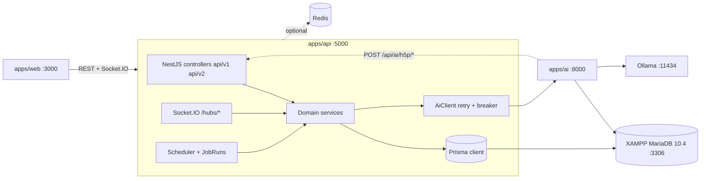

# SmartSchool Build Plan: Node.js LMS API on XAMPP MySQL

**Written:** 30 September 2026 (revision 4: clean workspace `smartschool/`, Python AI service retained)
**Scope:** Build the SmartSchool LMS API as `apps/api` (NestJS 11, Prisma 6) on the MySQL that ships with XAMPP, restore the Python AI service as `apps/ai`, and reach parity with the previous implementation's 1,107 non-test endpoints.
**Design context:** this plan executes [01-SYSTEM-ARCHITECTURE.md](01-SYSTEM-ARCHITECTURE.md); behaviour per module is in [02-FEATURE-CATALOG.md](02-FEATURE-CATALOG.md), tables in [03-DATA-MODEL.md](03-DATA-MODEL.md), boundaries in [04-INTEGRATION-CONTRACTS.md](04-INTEGRATION-CONTRACTS.md), decisions in [05-ADR.md](05-ADR.md).

---

## 0. Decisions in one page

| Decision | Choice | Why |
|---|---|---|
| Workspace | `smartschool/` pnpm workspace; `apps/api`, `apps/ai`, `apps/web`; `packages/*` | ADR-016 |
| Backend runtime | Node.js 22 LTS or newer (24.18 installed), TypeScript strict | Keeps the 1,100-endpoint surface type-checked |
| Framework | **NestJS 11** | ADR-002 |
| ORM | **Prisma 6**, MySQL connector | ADR-003 |
| Database | **XAMPP MariaDB 10.4.32** in development; MySQL 8 or MariaDB 10.11 in production; CI on both | ADR-004 |
| AI service | **Python, retained** as `apps/ai`, restored from the old repository | ADR-001 |
| Real-time | Socket.IO at the same `/hubs/*` paths | ADR-006 |
| Background jobs | `@nestjs/schedule` + `JobRuns`; BullMQ when Redis exists | ADR-007, ADR-014 |
| Endpoint scope | 1,107 of 1,126 previous endpoints; the 19 test-controller endpoints are dropped | exact counts from the inventory |
| Stubs | **Never port a fake** | ADR-008 |
| Agents | AI service owns the runtime; LMS is client and relay | ADR-009 |
| Ports | api 5000, ai 8000, MariaDB 3306, Ollama 11434 | Python's `DOTNET_API_URL` default is `localhost:5000` |

---

## 1. Starting point (30 September 2026)

- Workspace created: `smartschool/` with `apps/api` scaffolded (config validation, Prisma service, health, metrics, logging, error envelope, URI versioning, Swagger, CI on both database engines, bootstrap schema for the Phase 1 tables, seed skeleton).
- Previous implementation: only in the old repository's git history (C# API with 77 controllers and 1,126 routes; Python AI service with 155 routes; EF snapshot with 145 tables). Nothing of it is on disk.
- This machine: Node 24.18, pnpm 10, XAMPP at `C:\xampp` with MariaDB 10.4.32, Windows services `MySQL800` (running on 3306) and `MySQL80` (stopped), Ollama with `llama3.1:8b` and `llava`, no Redis, Python not on PATH.

Two inputs must be recovered from the old repository before Phase 0 can finish: `SmartSchool.Api/Migrations/AppDbContextModelSnapshot.cs` and `SmartSchool.AI/database.py` (for the full Prisma schema), and the whole `SmartSchool.AI` folder (to become `apps/ai`).

---

## 2. Target architecture

Summarised; the full design is in 01.



Three contracts must hold: the 12 AI-owned tables keep exact names and columns; the three H5P callback routes exist on port 5000; `AI_SERVICE_URL` and `DOTNET_API_URL` point at each other. The new `AiClient` also fixes the three RAG routes the previous LMS called that never existed (04 section 1.1).

---

## 3. Stack

| Concern | Choice |
|---|---|
| Web framework | NestJS 11, Express adapter |
| ORM | Prisma 6 |
| Validation | `class-validator` + `class-transformer` DTOs; `zod` for environment |
| Auth | `@nestjs/passport`, `passport-jwt`, HS256; `argon2` plus PBKDF2 verifier (ADR-011) |
| Permissions | Guards `@Roles`, `@MinRole(level)`, `@RequireFeature('code')`, `@FeatureGate('flag')` |
| Multi-tenancy | Middleware + `AsyncLocalStorage` + Prisma extension injecting `TenantId` |
| Real-time | `@nestjs/websockets` + `@nestjs/platform-socket.io` |
| Jobs | `@nestjs/schedule` + `JobRuns`; BullMQ with `REDIS_URL` |
| Cache, rate limit | `cache-manager`, `@nestjs/throttler`; Redis store optional |
| Events | `@nestjs/event-emitter` |
| HTTP to Python | native `fetch` + `opossum` breaker + retry |
| Logging, docs, metrics | `nestjs-pino`, `@nestjs/swagger`, `prom-client` |
| Files | `multer` disk storage, 10 MB, extension allowlist |
| PDF, Excel, 2FA, QR | `pdfmake`, `exceljs`, `otplib`, `qrcode` |
| Providers | `nodemailer`, `twilio`, `firebase-admin`, `stripe`, reCAPTCHA verify; enabled when credentials exist |
| Tests | Jest + `supertest` on `smartschooldb_test`; `prisma migrate reset` per suite |
| Tooling | pnpm workspaces, ESLint, Prettier, GitHub Actions |

---

## 4. XAMPP and MariaDB: the part that goes wrong

### 4.1 Port 3306 is taken

`MySQL800` (MySQL 8) owns 3306; XAMPP's MariaDB wants it. Recommended: stop and disable both MySQL services, let XAMPP own 3306. Alternative: XAMPP on 3307 (`my.ini` `[client]` and `[mysqld]`, `phpMyAdmin\config.inc.php`) and `DATABASE_URL` on 3307.

```powershell
# Run as Administrator
Stop-Service MySQL800; Set-Service MySQL800 -StartupType Disabled
Set-Service MySQL80 -StartupType Disabled
C:\xampp\mysql_start.bat
```

### 4.2 MariaDB 10.4 is not MySQL 8

| Difference | Rule |
|---|---|
| No `utf8mb4_0900_ai_ci` | `utf8mb4` / `utf8mb4_unicode_ci` everywhere; migrations never name a collation |
| `JSON` is `LONGTEXT` with a check | Prisma `Json` works; no JSON-path indexes |
| 65,535-byte row limit | Strings over 1,000 chars are `@db.Text`/`@db.LongText`; never index `TEXT` without a prefix |
| No reliable UUID expression defaults | Prisma `@default(uuid())`; `Id` stays `char(36)` |
| `lower_case_table_names=1` on Windows | Keep exact PascalCase names; same flag on the Linux server |
| Older optimizer | Carry the 529 indexes; add `(TenantId, …)` composites on tenant lists |
| No vector type | Vectors stay in the AI service (ADR-015) |

### 4.3 `my.ini` for development

```ini
[mysqld]
character-set-server=utf8mb4
collation-server=utf8mb4_unicode_ci
default-time-zone='+00:00'
sql_mode=STRICT_TRANS_TABLES,NO_ENGINE_SUBSTITUTION
innodb_buffer_pool_size=1G
innodb_default_row_format=DYNAMIC
max_allowed_packet=64M
max_connections=200
```

### 4.4 Users and databases

```sql
CREATE DATABASE smartschooldb CHARACTER SET utf8mb4 COLLATE utf8mb4_unicode_ci;
CREATE DATABASE smartschooldb_test CHARACTER SET utf8mb4 COLLATE utf8mb4_unicode_ci;
CREATE USER 'smartschool'@'localhost' IDENTIFIED BY '<choose-a-password>';
GRANT ALL PRIVILEGES ON smartschooldb.* TO 'smartschool'@'localhost';
GRANT ALL PRIVILEGES ON smartschooldb_test.* TO 'smartschool'@'localhost';
FLUSH PRIVILEGES;
```

Both services use the `smartschool` user (Prisma `mysql://…`, Python `mysql+pymysql://…`). `.env` is never committed; `.env.example` documents every key. Nightly `mysqldump` via Task Scheduler, 14-day retention.

---

## 5. Database plan

`apps/api/prisma/schema.prisma` is the schema owner. Phase 0 ships a bootstrap subset (identity, organisation, features, audit, IP whitelist, `JobRuns`). The full 145-table schema is generated once from the previous EF snapshot by `docs/tools/ef-snapshot-to-prisma.ts` (recovered from the old repository), merged into the same file, and hand-checked per domain. Every model keeps the exact table and column names (`@@map` where Prisma naming would differ). The 12 AI-owned tables are modelled from `database.py`; the AI service never runs migrations (its `create_all` must be a no-op, verified by a script).

Type mapping: `char(36)` → `String @db.Char(36)`; `varchar(n)` → `@db.VarChar(n)`; `longtext`/`TEXT` → `@db.LongText`/`@db.Text`; `datetime(6)` → `DateTime @db.DateTime(6)`; `tinyint(1)` → `Boolean`; `int`/`bigint` → `Int`/`BigInt`; `decimal(p,s)`/`double` → `Decimal`/`Float`; `json` → `Json`; `time(6)` → `DateTime @db.Time(6)`; `longblob` → `Bytes`.

Conventions: soft delete on 25 entities via a Prisma client extension; tenant scoping via a second extension; enums as `int` with a shared `enums.ts` matching the previous values (03 section 6); one migration per phase; `prisma/seed.ts` reproduces the previous seeders idempotently.

---

## 6. Cross-cutting design

Specified in 01 section 8. Implementation notes:

- **Identity:** `AspNetUsers` shape kept; argon2id for new hashes; PBKDF2 (Identity v3: marker `0x01`, HMAC-SHA256, 10,000 iterations, 16-byte salt, 32-byte subkey) verified and upgraded; JWT claims `sub, jti, email, name, role, FirstName, LastName, tenant_id`; 15 minutes or 30 days; 7-day refresh; TOTP with `otplib`; reset tokens emailed and returned only in development.
- **Authorisation:** role levels SuperAdmin 6 to Parent and Assistant 1; feature set cached five minutes per user; ownership in services.
- **Multi-tenancy:** header, subdomain, custom domain, JWT claim, query; five-minute cache; same 403 bodies; excluded paths `/health`, `/swagger`, `/api/auth/login`, `/api/auth/register`, `/api/system`, `/api/tenants/public`; response headers `X-Tenant-Id`, `X-Tenant-Name`.
- **API conventions:** URI versioning with prefix `api/v`; controllers declare `version: ['1', VERSION_NEUTRAL]` so `api/Course` and `api/v1/Course` both resolve; v2 controllers separate; routes copied verbatim from the inventory; camelCase; UTC; GUIDs; `PagedResponse`; one error envelope (`success, message, errorCode, errors?, timestamp`); Swagger at `/swagger`.
- **Rate limiting and audit:** key precedence API key, user, IP; GUID and numeric id normalisation; `X-RateLimit-*` and `Retry-After`; 429 body `{ error: "rate_limit_exceeded", … }`; bypass `/health*`, `/swagger*`, `/metrics`, `OPTIONS`; fail-open; `@AuditLog` interceptor on 2xx.
- **Real-time:** four namespaces with the contracts in 04; JWT via `access_token`; Redis adapter only with multiple instances.
- **Jobs:** the 7 previous schedules and 4 scheduler jobs on `@nestjs/schedule` with `JobRuns`; `/api/admin/jobs` replaces the Hangfire dashboard.
- **Events:** six domain events with real handlers.
- **AiClient:** one injectable client wrapping every AI route with typed DTOs (snake_case mapping at the boundary), 30 s default and 120 s generation timeouts, three retries, breaker, optional `X-API-Key`; health check reports AI reachability.
- **Callbacks:** `/api/ai/h5p/content`, `/validate`, `/libraries` authenticated by `AI_CALLBACK_TOKEN`.

Configuration is documented in `apps/api/.env.example` and validated at boot by `src/config/env.schema.ts` (ADR-012).

---

## 7. Project structure

```
smartschool/
├── apps/api/
│   ├── prisma/ {schema.prisma, migrations/, seed.ts}
│   ├── src/
│   │   ├── main.ts  app.module.ts
│   │   ├── config/   env.schema.ts (zod), app-config.service.ts
│   │   ├── common/   filters, interceptors, guards, decorators, dto (PagedResponse)
│   │   ├── infra/    prisma/, tenant/, cache/, jobs/, events/, ai-client/, storage/, mail/, sms/, push/, billing/, captcha/
│   │   ├── modules/  one folder per bounded-context module (01 section 4.2); health/ and metrics/ exist
│   │   └── gateways/ notifications, messaging, agents, collaboration
│   ├── test/         e2e per module, fixtures, contract-diff
│   └── .env.example  package.json
├── apps/ai/          Python AI service, restored from the old repository (Phase 4)
├── apps/web/         Next.js client (Phase 11)
├── packages/         shared code when needed
├── docs/             this design set; tools/extract-routes.cjs, tools/ef-snapshot-to-prisma.ts
└── .github/workflows/ci.yml
```

Each module: `x.controller.ts` (routes from the inventory), `x.service.ts`, `dto/`, `x.spec.ts`, `x.e2e-spec.ts`.

---

## 8. Delivery plan

One full-time backend developer. With a second developer the backend compresses to roughly 14 weeks and the frontend runs in parallel from Phase 2. Endpoint counts are from the inventory.

| Phase | Weeks | Goal | Modules (endpoints) | Total | Exit criteria |
|---|---|---|---|---|---|
| 0 Foundation | 1 | Environment and skeleton | Workspace, XAMPP fix, DB users, config validation, Prisma service, Health (6), `/metrics`, `/swagger`, pino, CI on MariaDB 10.4 and MySQL 8; recover the EF snapshot and generate the full schema; first migration; seed roles and demo organisation | 6 | `pnpm test` green locally and in CI; `/health` reports the XAMPP database up; `prisma migrate dev` applied |
| 1 Identity and access | 2–3 | Log in and enforce permissions | Auth v1 (7), Auth v2 (5), Organization (5), Security (8), IPWhitelist (5), FeatureManagement (7), RoleFeature (8), UserFeatureOverride (6), FeatureFlags (3); tenant resolution, rate limiting, audit; feature catalogue seed | 54 | Seeded users log in; PBKDF2 test passes; Student blocked from `students.create` |
| 2 Core LMS | 4–6 | Run a class end to end | Student (6), Course (6), Class (6), Assignment (7), Grade (5), Attendance (5), Announcement (5), File (5), Notification (9), Calendar (25), DistrictSchool (7), DistrictStaff (8), DistrictBudget (9), Reports (5), Mobile (6) | 114 | Course to graded submission to PDF transcript through the API with tests |
| 3 Communication and engagement | 7–8 | Real-time and motivation | Messaging (29) + gateway, notifications gateway, PushNotification (4), Gamification (15), ParentPortal (20), ParentPortal v1 (20), Webhooks (14) + delivery job, mail and SMS adapters | 102 | Two socket clients chat; XP on grade; webhook retried and delivered |
| 4 AI bridge | 9–10 | Every AI feature calls Python | Restore `apps/ai` from the old repository, venv, `.env`; AI (4), AIContent (6), TeacherAI (29), SuperintendentAIChat (7), Agent (34) + `/hubs/agents` relay, AIH5P (10, callbacks), ContentRecommendations (22), Analytics v1 (7), StudentAnalytics (2), ClassAnalytics (3), OrganizationAnalytics (2); `AiClient` with correct RAG routes | 126 | Tutor chat returns an Ollama answer; grade suggestions come from `/api/ai/assessment/grade-essay`; Python's H5P storage round-trip works; Python `create_all` is a no-op; contract-diff green |
| 5 H5P and xAPI | 11–12 | Interactive content and the LRS | H5P (36), H5PContentTypes (23), XAPI (20), H5PxAPI (17) plus the completion hooks (XP, spaced repetition, cognitive load) | 96 | Save a result: xAPI statement, XP and SRS card appear |
| 6 Learning science | 13–14 | Adaptive features | SpacedRepetition (17), Mastery (8), CognitiveLoad (9), LearningCurve (8), SEL (26), Accessibility (30), Career (24), IntegratedLearning (29) | 151 | SM-2 unit tests; previous placeholder metrics replaced or 501 |
| 7 Content ecosystem | 15–16 | Library and community | ContentLibrary (29), ContentCollections (34), ContentAnalytics (19), Community (70), DigitalLibrary (13) | 165 | Semantic search via the AI service; moderation flow tested |
| 8 Multi-tenant SaaS | 17–19 | White-label and billing | Tenant (45), TenantAdmin (18), TenantAnalytics (16), TenantBilling (20), TenantSecurity (13), TenantCompliance (39), TenantWebhook (29), TenantReports (30), ApiGateway (12) | 222 | Automated two-tenant isolation test; Stripe test-mode invoice |
| 9 Portfolio and careers | 20–21 | Student showcase | Portfolio (20), PublicPortfolio (7), Stakes (9), Resume (8), Code (15), Recruiting (12) | 71 | Code runs only through the AI service's sandboxed evaluator or returns 501 (ADR-013) |
| 10 Hardening | 22–24 | Ship | k6 load test, security review, docs, Docker Compose (api, ai, mariadb, ollama, optional redis), production DB target | 0 | p95 under 200 ms on lists; zero high `pnpm audit`; runbook |
| 11 Frontend (parallel) | from 6 | `apps/web` | Login, dashboards, CRUD, AI tutor, live chat; `socket.io-client`; `h5p-standalone` | | End-to-end user journeys |

Dropped: `H5PTestController` (6), `H5PxAPITestController` (11), `H5PAutoXAPITestController` (2); their coverage moves to Jest. Totals: 1,107 ported, 19 dropped, 1,126 inventoried.

### Per-endpoint definition of done
1. Route, verb, auth and JSON shape match the inventory and the previous response.
2. Request DTO validated; response DTO typed.
3. Logic ported without fakes; anything unavailable returns 501 with a reason.
4. One e2e test on the XAMPP test database.
5. Swagger description present.

---

## 9. Testing and quality gates

- **Unit:** services with Prisma mocked; exhaustive tests for SM-2, role hierarchy, rate-limit windows, PBKDF2 verifier, xAPI verb mapping.
- **Integration:** supertest on `smartschooldb_test`; migrate reset then seed per suite.
- **AI contract:** recorded fixtures per `AiClient` method; nightly live run with Ollama; the three callback routes tested against the AI service's `h5p_storage.py`.
- **Isolation:** two-tenant test over every tenant-scoped list endpoint.
- **CI:** matrix on `mariadb:10.4` and `mysql:8.0`; lint, typecheck, unit, e2e, `pnpm audit --audit-level=high`, migration drift. Coverage floor 70 percent, plus 5 per phase.
- **Smoke:** `tools/smoke.ts` logs in as each seeded role and hits a curated route list.

---

## 10. Risks and mitigations

| Risk | Likelihood | Mitigation |
|---|---|---|
| MariaDB and MySQL 8 diverge | High | Section 4.2; CI on both engines from Phase 0 |
| Port 3306 clash with `MySQL800` | Certain | Section 4.1, day one |
| Old repository unreachable or the snapshot missing | Medium | Fallback: author the schema by hand from 03 and the inventory, domain by domain |
| Redis absent on Windows | Certain today | In-memory defaults everywhere (ADR-014) |
| Ollama latency 5 to 30 s | High | Long timeouts on generation, batch through the AI service queue, cache, never an LLM call in a list endpoint |
| 1,107 endpoints tempt shortcuts | High | Definition of done; scope by phase |
| Porting fakes as real | Medium | The feature catalog status column is the gate checklist (ADR-008) |
| Old secrets reused | Medium | New credentials only; `.env` ignored; scanning in CI (ADR-012) |
| Python not runnable here | Certain today | Install Python 3.11 or 3.12, venv, requirements; in Phase 4 |
| Code execution RCE | Medium | Sandbox or 501 (ADR-013) |
| XAMPP in production | Medium | Dev-only; Docker Compose in Phase 10 (ADR-004) |

---

## 11. Week 1 checklist

```powershell
# 1. Database (Administrator)
Stop-Service MySQL800; Set-Service MySQL800 -StartupType Disabled; Set-Service MySQL80 -StartupType Disabled
# edit C:\xampp\mysql\bin\my.ini per section 4.3, then:
C:\xampp\mysql_start.bat
# run the SQL in section 4.4 in phpMyAdmin (http://localhost/phpmyadmin)

# 2. Workspace (already scaffolded)
cd C:\Users\bishw\OneDrive\Desktop\SmartSchool\smartschool
pnpm install
copy apps\api\.env.example apps\api\.env      # set DATABASE_URL password, JWT_SECRET, AI_CALLBACK_TOKEN
pnpm --filter @smartschool/api prisma:generate
pnpm --filter @smartschool/api test           # unit tests, no database needed

# 3. First migration and seed (needs the XAMPP database from step 1)
pnpm --filter @smartschool/api prisma:migrate -- --name phase0_bootstrap
pnpm --filter @smartschool/api db:seed
pnpm --filter @smartschool/api dev            # http://localhost:5000/swagger, /health, /metrics

# 4. Recover the previous schema sources from the old repository
git clone <old-repo-url> C:\src\smartschool-previous
node docs/tools/extract-routes.cjs C:\src\smartschool-previous\SmartSchool.Api\Controllers C:\src\smartschool-previous\SmartSchool.AI\main.py > docs\06-ENDPOINT-INVENTORY.md
pnpm ts-node docs/tools/ef-snapshot-to-prisma.ts C:\src\smartschool-previous\SmartSchool.Api\Migrations\AppDbContextModelSnapshot.cs C:\src\smartschool-previous\SmartSchool.AI\database.py > apps\api\prisma\generated.prisma
# merge generated.prisma into schema.prisma, then:
pnpm --filter @smartschool/api prisma:validate
pnpm --filter @smartschool/api prisma:migrate -- --name phase0_full_schema

# 5. Commit
git add -A; git commit -m "Phase 0: workspace, API foundation, bootstrap schema, design docs"
```

Deliverable at the end of week 1: `apps/api` boots on 5000 against XAMPP with health, Swagger, metrics and seed data; the full schema exists in Prisma; the endpoint inventory is regenerated; CI is green on both database engines.

---

## 12. Port and service map

| Service | Port | Started by |
|---|---|---|
| XAMPP Apache and phpMyAdmin | 80 | XAMPP control panel |
| XAMPP MariaDB | 3306 | XAMPP control panel |
| apps/api | 5000 | `pnpm dev` |
| apps/ai | 8000 | `uvicorn main:app` |
| Ollama | 11434 | Ollama service |
| apps/web | 3000 | `pnpm --filter @smartschool/web dev` |
| Redis (optional) | 6379 | Memurai or Docker |
| RabbitMQ (optional, AI only) | 5672 / 15672 | Docker |

---

## 13. What is not carried over

- The three H5P test controllers and the thirty shell test scripts of the previous repository.
- The Hangfire dashboard (replaced by `/api/admin/jobs`).
- The `AIService:BaseUrl` versus `AIServices:RAG:BaseUrl` split (one key: `AI_SERVICE_URL`).
- Direct Ollama calls from the LMS (the AI service owns model routing).
- The C# agent runtime (ADR-009); its guardrails and audit survive at the LMS boundary.
- Every "Simulated" branch and every committed credential.
